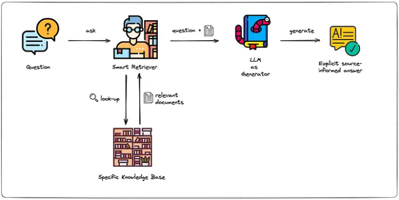

# LLM Permit Insights Pipeline

This project implements a simple LLM and RAG pipeline to gain insights about the permit data.

## Models
Ollama model
* Runs LLMs efficiently on a CPU
* Supports models like phi3
* Compatible with the OpenAI API

ElasticSearch

## RAG Workflow



[Image Source: medium.com](https://medium.com/artificial-corner/retrieval-augmented-generation-rag-a-short-introduction-21d0044d65ff)

The original paper: [Link](https://arxiv.org/pdf/2005.11401)

## Prompt
* Task descriptoin: Descript a question and a task for the model
* RAG: Providing LLM with a database with domain specific information
* Input: The input
* Output: Specifies how the model output will be

## Searching with ElasticSearch

* Run ElasticSearch with Docker
* Index the documents

Running ElasticSearch:

```bash
docker run -it \
    --rm \
    --name elasticsearch \
    -m 4GB \
    -p 9200:9200 \
    -p 9300:9300 \
    -e "discovery.type=single-node" \
    -e "xpack.security.enabled=false" \
    docker.elastic.co/elasticsearch/elasticsearch:8.4.3
```

## Search with Ollama

* Run Docker
* Pull Ollama phi3

```bash
docker-compose up
```
```bash
docker exec -it ollama bash
```
```bash
ollama pull phi3
```

## Next step:
Explore Open-Source LLM Alternatives

Since Ollama works with the OpenAI API (which is expensive), I will looking into using open-source LLMs with a GPU in Saturn Cloud.
